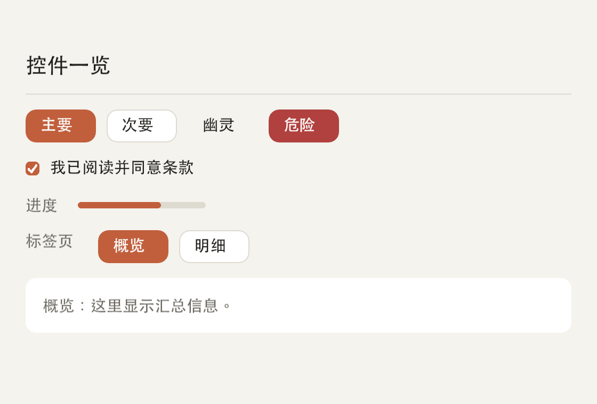
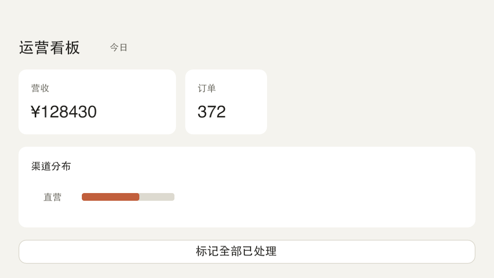

# Tessera

A GPU-accelerated cross-platform UI toolkit for [Racket](https://racket-lang.org/). One functional view tree, GLFW windowing, an OpenGL renderer, and real text — with **no C toolchain** on your machine.

 [](LICENSE)

**English** · [中文](README.zh-CN.md)

<p align="center"></p>
<p align="center"></p>

## Why Tessera?

Racket ships `racket/gui`, and it works — but it is hard to style into a modern product-grade UI, and it pins you to one platform look. Tessera takes a different approach:

- **GPU-rendered** — one batched triangle stream over fixed-function OpenGL; thousands of quads per frame at 60 fps
- **Declarative views** — your UI is a plain immutable tree returned from a function; state stays in your app (Elm-style `update`)
- **Real text** — TrueType parsing, scanline rasterization, kerning, CJK via a fallback face; mixed-script strings render correctly
- **Agent-friendly** — headless snapshot rendering (`render-view->png`) gives pixel-precise verification from plain `racket` code
- **No C toolchain** — GLFW and the font parser load at runtime through Racket's FFI; `raco pkg install` is all you need

## Requirements

| Dependency | Purpose / Version |
|------------|-------------------|
| [Racket](https://racket-lang.org/) | 9.x (CS) or later |
| [GLFW 3](https://www.glfw.org/) | runtime-loaded, no headers needed |

Platform notes: macOS uses the legacy-profile GL pipeline (see honest gaps below); Linux uses the same pipeline through Mesa or vendor drivers.

## Quick Start

### 1. Install

```bash
git clone https://github.com/turinglambdaai/tessera.git
cd tessera
raco pkg install --name tessera --link .
```

### 2. Run an example

```bash
racket examples/counter.rkt
```

### 3. Write your app

```racket
#lang racket/base
(require tessera)

(run #:title "计数器"
     #:width 360 #:height 220
     #:init-state 0
     #:update (λ (s m) (match m ['inc (add1 s)] ['reset 0] [else s]))
     #:view   (λ (s)
                (column #:spacing 16
                        (text (format "点击次数：~a" s) #:size 28)
                        (button "＋1" #:on-click (λ () 'inc)))))
```

The model is Elm-style: `state` is yours, `#:update` folds messages into it, and `#:view` is a pure function from state to widgets. `run` returns the final state after the window closes.

## Widgets

| Widget | Description |
|--------|-------------|
| `text` | styled string: `#:size` `#:color` `#:align` |
| `button` | `#:kind` primary/secondary/ghost/danger, `#:on-click` returns messages |
| `checkbox` | `#:checked?` + `#:on-change` receives the new boolean |
| `input` | single-line text field: `#:value` `#:on-change` `#:placeholder` `#:password?` |
| `progress` | determinate bar, value in `[0,1]` |
| `divider` | horizontal rule |
| `row` / `column` | flex containers: `#:spacing` `#:padding` `#:align` |
| `box` | padded rounded surface: `#:bg` `#:radius` `#:border` |
| `spacer` | rigid or `#:flex` empty space |

Keywords may appear in any position — `(column #:spacing 12 (button "ok"))` and `(column (button "ok") #:spacing 12)` are the same.

## Text

Latin and CJK render from TrueType faces (`.ttf`/`.ttc`), resolved per platform with a `TESSERA_FONT` override:

```racket
(text "Racket 你好" #:size 16)          ; mixed script
(wrap-text fs "long paragraph..." 400)  ; greedy wrap, CJK-aware breaks
```

Per-character fallback: a Latin primary face plus a CJK-capable fallback face (STHeiti on macOS, Noto CJK on Linux) covers mixed-script strings.

## Verification built in

Because views are data, you can render them headlessly and assert on pixels:

```racket
(require tessera/snapshot)
(render-view->png "out.png" my-view #:width 480 #:height 320)
```

Tessera's own test suite is built on this: every screenshot in this README is produced by `raco test`.

## Architecture

```
your app ──> run (Elm loop) ──> view tree (plain data)
                                │ layout: measure + arrange (points)
                                ▼
                          laid tree ──draw-laid!──> OpenGL (GLFW window)
                                                   └ snapshot: PNG
```

- `tessera/platform` — GLFW windowing + GL context, one API per OS
- `tessera/render` — batched triangle stream, tessellated rounded geometry, MSAA
- `tessera/text` — TrueType parser, scanline rasterizer, glyph atlas
- `tessera/view` / `tessera/layout` — declarative views and their rectangles

## Honest gaps

- **No multi-window yet** — one window per `run`; a second window closes the first
- **Kerning is parsed but disabled** — the legacy `kern` header has two variants; the validated pass ships in 0.2
- **CFF/PostScript outlines are rejected** — `.otf` fonts fail at load; system fallback resolution skips them
- **No IME composition** — GLFW delivers committed text only; CJK input works through your OS clipboard/IME tooling, not in-window composition
- **Single-line `input`** — no multi-line editor yet

## Examples

| Example | Demonstrates |
|---------|--------------|
| `examples/counter.rkt` | the minimal Elm-style app |
| `examples/gallery.rkt` | every widget in one window |
| `examples/login.rkt` | controlled inputs, validation, submit flow |
| `examples/dashboard.rkt` | cards, progress bars, secondary buttons |

## Development

```bash
raco test test/                 # unit + smoke + snapshot tests (needs a display)
raco make main.rkt              # compile
raco scribble --dest doc tessera.scrbl
```

Snapshot tests write PNGs into `test/snapshots/` — inspect them after failures; a picture beats a pixel assertion.

## License

Licensed under the [MIT License](LICENSE).
